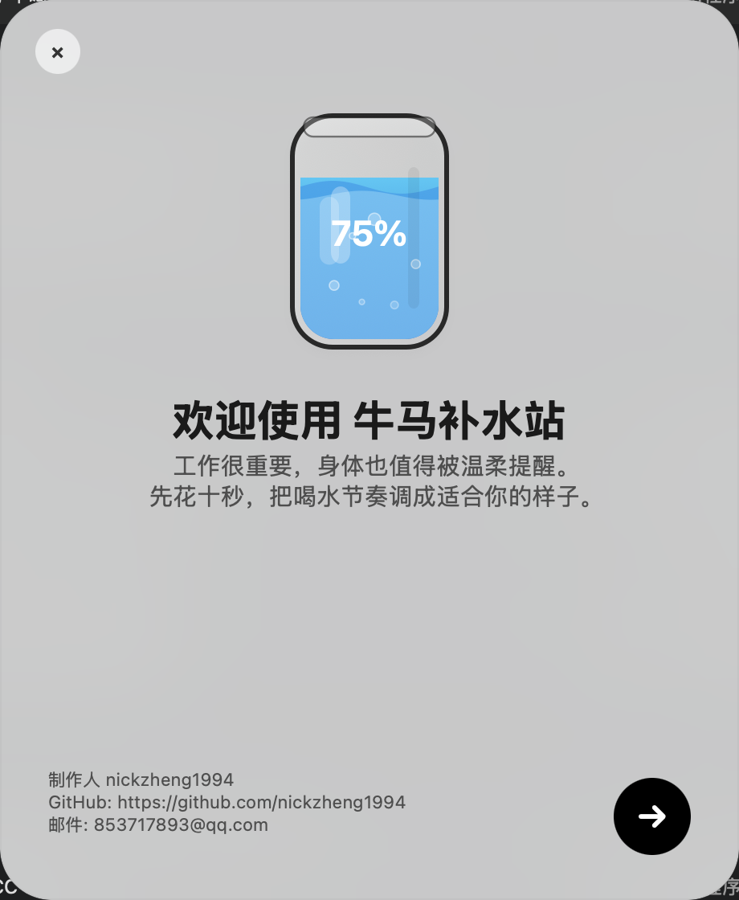
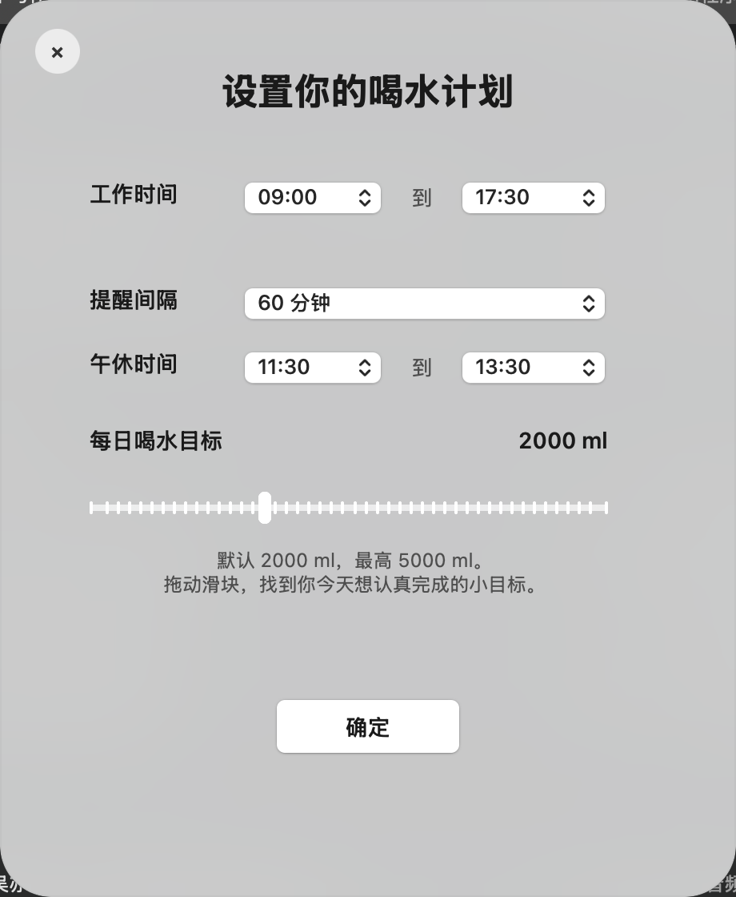
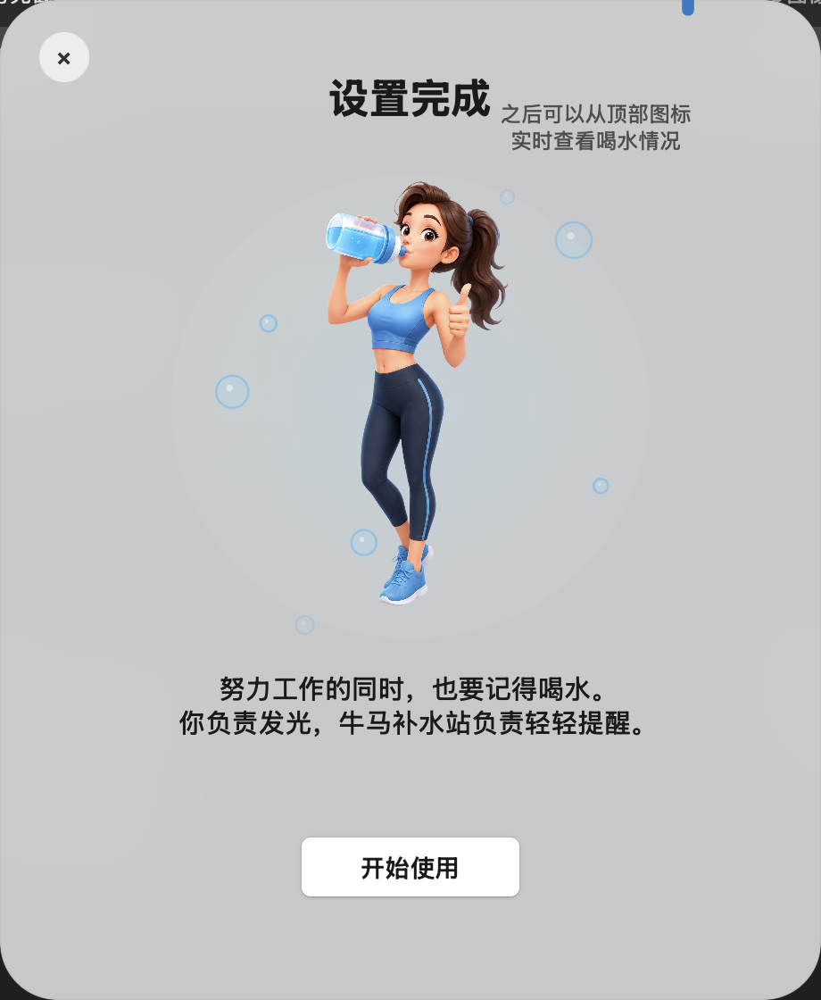
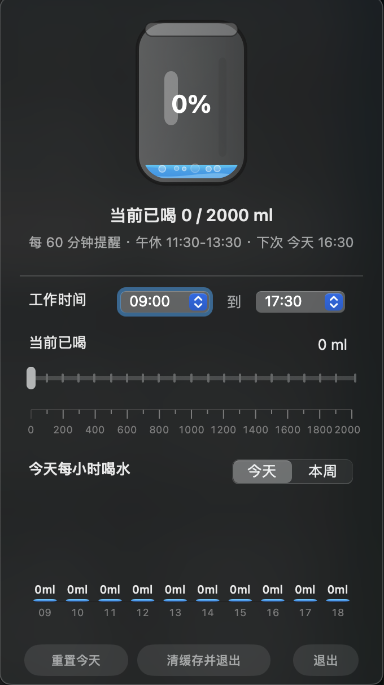

# 牛马补水站

一个 macOS 菜单栏喝水提醒 App，写给认真搬砖但经常忘记喝水的打工人。

工作要紧，身体也要被温柔提醒一下。

## 界面预览

| 首次欢迎 | 喝水计划 |
| --- | --- |
|  |  |

| 设置完成 | 菜单栏面板 |
| --- | --- |
|  |  |

## 下载

直接下载最新版：

[牛马补水站-macOS.zip](https://github.com/nickzheng1994/newdrink/raw/main/downloads/%E7%89%9B%E9%A9%AC%E8%A1%A5%E6%B0%B4%E7%AB%99-macOS.zip)

也可以前往 GitHub Releases 查看后续版本：

[https://github.com/nickzheng1994/newdrink/releases](https://github.com/nickzheng1994/newdrink/releases)

下载后解压，双击 `牛马补水站.app` 即可运行。首次打开如果 macOS 提示来自未验证开发者，可以在“系统设置 -> 隐私与安全性”中允许打开，或右键 App 后选择“打开”。

## 适合谁

- 久坐办公、经常一忙就忘记喝水的人
- 想按工作时间自动提醒，但午休不想被打扰的人
- 想看到今天喝了多少、每个小时喝了多少的人
- 喜欢菜单栏小工具，不想开一个大窗口的人

## 功能

- 菜单栏水滴图标，点击后展开实时喝水面板
- 首次启动引导设置工作时间、午休时间、提醒间隔和每日目标
- 默认工作时间：09:00 到 17:30
- 默认午休时间：11:30 到 13:30，午休期间不会提醒
- 默认每日喝水目标：2000 ml，最高可设置到 5000 ml
- 提醒间隔可选：15 分钟、30 分钟、60 分钟
- 到点后直接弹出置顶提醒窗口，不依赖系统通知中心
- 提醒时可选择本次喝水量：100 ml 到 550 ml，50 ml 为间隔
- 点击喝水量选项即记录完成，不需要再点完成按钮
- 顶部面板显示当前已喝水量，可拖拽滑块手动调整
- 滑块范围 0 到当前每日目标，100 ml 为一个单位
- 每次喝水都会记录本地事件，手动调整会记录差值
- 默认展示今天每小时喝水图表，可切换查看本周
- 下班时间主动弹窗统计今天每个小时喝了多少水
- 距离下班前 30 分钟提醒给手机充电
- 提醒、统计和充电提示都使用无边框液态玻璃风格弹窗
- 面板提供“清缓存并退出”，方便重新测试首次进入流程

## 使用说明

1. 打开 `牛马补水站.app`。
2. 第一次进入时，点击欢迎页右下角箭头。
3. 设置你的工作开始时间、下班时间、提醒间隔、午休时间和每日喝水目标。
4. 点击“确定”，看到设置完成页后点击“开始使用”。
5. 之后 App 会常驻在 macOS 顶部菜单栏，点击水滴图标即可查看当前喝水进度。
6. 到提醒时间时，会弹出喝水窗口，选择本次准备喝的容量，例如 `200 ml`、`250 ml` 或 `300 ml`。
7. 如果暂时不方便喝水，可以选择稍后 5 分钟提醒。
8. 如果实际喝水量和记录不同，可以在顶部面板拖拽“当前已喝”滑块手动校准。

## 提醒规则

- 只在工作时间内提醒。
- 午休时间内不会提醒。
- 每次提醒按你选择的间隔计算，支持 15、30、60 分钟。
- 到下班时间会弹出当天统计，展示每个小时喝了多少水。
- 下班前 30 分钟会额外提醒手机充电。
- 所有设置和记录都保存在本机，不需要登录账号。

## 本地数据

设置、喝水记录和首次进入状态保存在 `NSUserDefaults`，Bundle ID 为：

```text
com.ehousechina.drinktime
```

如果想重新体验首次进入流程，可以点击顶部面板里的“清缓存并退出”。

## 从源码构建

需要 macOS 和 Xcode Command Line Tools。

```bash
./build_app.sh
```

构建完成后运行：

```bash
open ".build/牛马补水站.app"
```

## 项目结构

```text
.
├── Assets/                         # 图标和界面图片资源
├── Sources/WaterReminder/main.m     # AppKit 主程序
├── downloads/                       # 已打包的下载文件
├── docs/screenshots/                # README 展示截图
├── Info.plist
└── build_app.sh
```

## 作者

制作人：nickzheng1994

GitHub：[https://github.com/nickzheng1994](https://github.com/nickzheng1994)

邮箱：853717893@qq.com

## 许可证

MIT License
